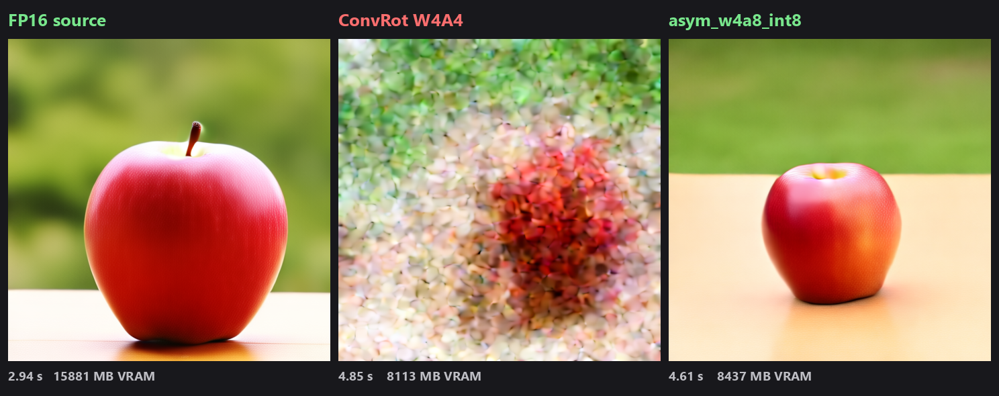
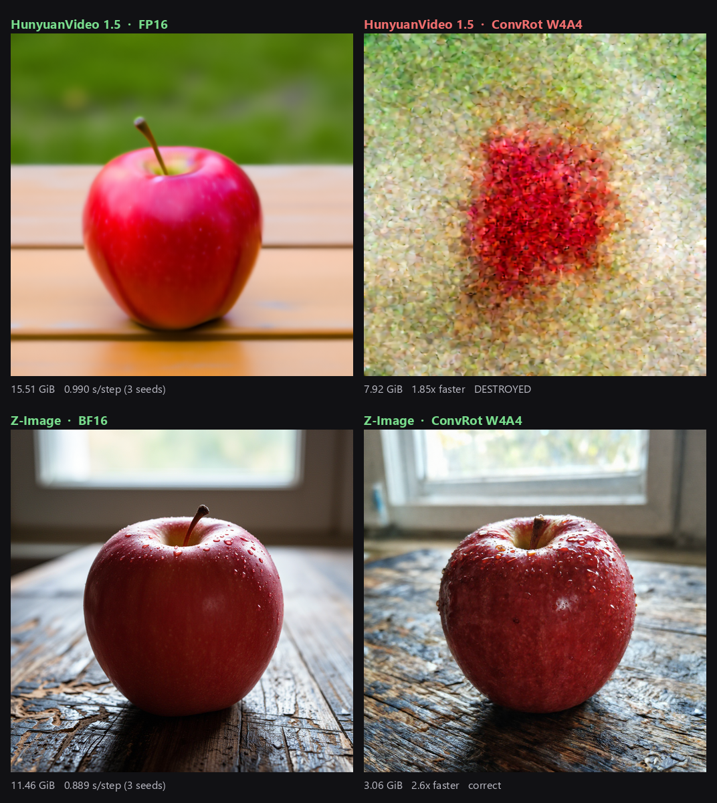
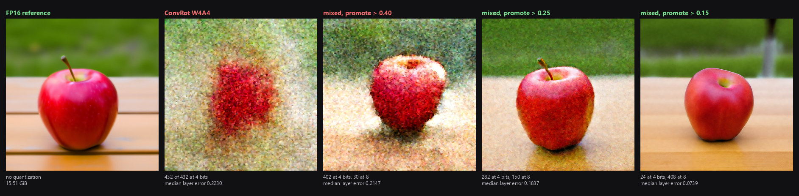
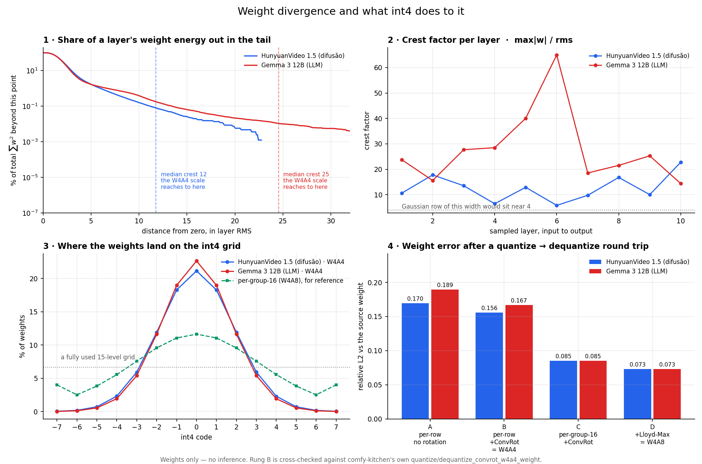

# comfy-quant-bench

4-bit quantization for ComfyUI checkpoints that actually executes its kernel instead of quietly
dequantizing back to a full-precision GEMM — plus the measurements showing which 4-bit format is
worth using.

*Renamed from `ComfyUI-ConvRot-Quant` on 2026-08-31. The old URL redirects. ConvRot was the only
format here in August; it is now one of several, and what the repo actually does is measure whether
a quantization does what it claims.*

**Default to `tools/quant_w4a8.py`.** W4A4 is a real option on some models and a catastrophe on
others, and the only way to know which is to render. See
[When W4A4 works, and when it does not](#when-w4a4-works-and-when-it-does-not) — that section is
newer than everything below it and narrows a claim this README used to make without qualification.



HunyuanVideo 1.5, RTX 3090, identical prompt, seed, steps, resolution, sampler and scheduler.
Model resident, seeds varied so ComfyUI could not serve a cached result. Times are ComfyUI's own
`Prompt executed`.

| Format | Time | VRAM staged | On disk | Image |
| --- | --- | --- | --- | --- |
| FP16 source | **2.94 s** | 15881 MB | 15.51 GiB | correct |
| ConvRot W4A4 | 4.85 s | 8113 MB | 7.92 GiB | **destroyed** |
| **asym_w4a8_int8** | **4.61 s** | 8437 MB | 8.24 GiB | **correct** |

ConvRot W4A4 is slower than FP16 *and* destroys the output, so its VRAM saving buys nothing. W4A8
is faster than W4A4 and produces a correct image for 4% more disk: **1.57x slower than FP16 for
1.88x less VRAM**, which is a real trade.

W4A4 was tested at Hadamard group sizes 256, 64 and 16. All three are unusable; the parameter does
not rescue it. The ConvRot paper reports 2.26x speedup on FLUX.1-dev; that did not reproduce here.

The W4A4 converter is kept because the format is a useful fixture for kernel and loader work, and
because a negative result with a reproduction is worth more than silence.

## 2026-09-13: five more families, the soundtrack, and what a LoRA becomes in 4 bits

*This repo is now the full bench, not a curated subset.* Everything below is measured on one RTX 3090
(with an RTX 3080 Ti as donor/offload), and every claim carries its evidence on the Hub repo it
belongs to. The running log is [`W4A4_PROGRESS.md`](W4A4_PROGRESS.md); the rules this bench works by,
with every correction it had to make to itself, are in [`CLAUDE.md`](CLAUDE.md); the criteria written
*before* each measurement are in [`bench/criterio_*.md`](bench/).

**Four-bit weights survive everywhere measured; four-bit activations fail in three families of 2026
models, three different ways.** Same 4-bit weights, only the activation path differs:

| model | W4A4 result | W4A8 result | published |
| --- | --- | --- | --- |
| Qwen-Image-Edit 2511 (20.4 B) | pure static | good, 38.05 → 10.79 GiB | [Qwen-Image-Edit-2511-W4A8-ConvRot](https://huggingface.co/JoaoZaokk/Qwen-Image-Edit-2511-W4A8-ConvRot) |
| Qwen-Image 2512 | coloured speckle | good, 38.05 → 10.79 GiB, 3.65x faster/step | [Qwen-Image-2512-W4A8-ConvRot](https://huggingface.co/JoaoZaokk/Qwen-Image-2512-W4A8-ConvRot) |
| Wan 2.2 TI2V 5B | blur | good, 9.31 → 2.75 GiB, 1.59x faster/step | [Wan2.2-TI2V-5B-W4A8-ConvRot](https://huggingface.co/JoaoZaokk/Wan2.2-TI2V-5B-W4A8-ConvRot) |
| LTX 2.5 22B distilled | — (riftcast's W4A4 works) | good, 39.13 → 11.66 GiB, 1.95x faster than BF16 on a 10 s render | [LTX-2.5-22B-distilled-W4A8-ConvRot](https://huggingface.co/JoaoZaokk/LTX-2.5-22B-distilled-W4A8-ConvRot) |
| Krea 2 Turbo (12.8 B) | works, ceiling not reached at cg 16 | — | held back by the model's licence gate |

Where the model's author publishes their own INT8, it is the more faithful arm every time (five
families in a row: 1.9x on LTX 2.5's picture, 2.9x on its sound) and ours is ~1.7–1.8x smaller. The
choice is a trade, and each card shows what the trade costs.

**The LTX card measured half the model, and that was corrected.** LTX 2.x generates video *and
audio* in one latent; the first LTX 2.5 card decoded only the frames. Re-rendered with the audio
branch decoded (`tools/ltx_video.py`, measured by `tools/compara_av.py` with silence and white noise
as controls): the soundtrack ranks the arms the way the picture does and by a wider margin —
Lightricks' INT8 at log-mel L1 0.041 against our W4A8's 0.120 (white noise scores 1.47). The MP4s
with their audio tracks and the lossless FLACs are on the Hub repo as proof. The re-render came back
pixel-identical to the first run in all three arms.

**A LoRA loaded onto a quantized weight is a requantization**, not a branch: ComfyUI dequantizes,
adds the delta and requantizes back to 4 bits (`comfy/ops.py:1449-1457`). Measured on the real path
(`tools/probe_lora_requant.py`) across Z-Image, Krea 2, Wan 2.2, LTX 2.5 and Qwen-Image-Edit: the
delta survives in expectation (survival 0.86–1.00), but what lands is the delta plus noise 2–100x its
size, and a no-op requantization already costs 4–14 % extra weight error. A LoRA from the wrong
architecture, or one that ships all-zero `lora_B` tensors (the `ltx2-squish` LoRA does, for every
audio family), still gets its layers requantized — the model gets worse with nothing applied, and the
only trace is a log line. **And the output contradicts the weight:** on Qwen-Image-Edit W4A8 the
Lightning 4-step LoRA — 86 % survival, noise 103x the delta — works completely at the output, with the
control that has to fail (4 steps without it) failing identically on INT8 and W4A8. Weight-space
numbers rank and alarm; the render decides. Criterion and results: [`bench/criterio_lora.md`](bench/criterio_lora.md).

**LTX 2.3 distilled 1.1, measured 2026-09-14** on the same 10-second protocol with audio, at 8 steps,
against the BF16 original, a W4A4 build of the same source and a third-party GGUF Q6_K — every arm on
the same saved conditioning: W4A8 at MAE 10.39 / log-mel 0.163 is usable and 3.4x smaller in the
transformer; W4A4 does not break and is worse (fourth family that tolerates A4); the 6-bit GGUF is
2.9x closer in the frames and 2.2x slower per step; **and the soundtrack does not separate W4A8 from
Q6_K** (0.163 against 0.163) where the picture puts them 3x apart. Three things had to be built to
get there, each measured before being trusted. The BF16 reference could not be opened through
ComfyUI's safetensors reader on a 64 GB Windows box — the cause is **commit charge**, not the network
share (`safe_open` costs 2x the file, the model another 1x; six server deaths) — so the same bytes
went into a lossless GGUF container (`tools/safetensors_to_gguf_bf16.py`, 12/12 layers bit-identical
through the loader). ComfyUI-LTXVideo's conditioning saver drops the flag LTX 2.3 needs and renders
noise (MAE 75.9), so `tools/ltx_encode_lowcommit.py` and the `VoidLoadConditioningFull` node keep
every option, behind an identity control (MAE 1.74) that is not optional. And the render tool's own
"s/step" field turned out to be whole-run wall-clock — the sampler's progress bar is the per-step
instrument (`tools/sampler_tempo_do_log.py`), and the 2.5 card was corrected for the same defect.
LoRAs on the 2.3 W4A8, measured at the output twice: the LoRA arrives (with its trigger it rotates
the product as asked; a seed change still moves more), merged and bypass agree to within a fifth of
the effect, and the bypass loader lowers the audio level both times and costs 24 % per step.
Criteria written first: [`bench/criterio_ltx23.md`](bench/criterio_ltx23.md),
[`bench/criterio_lora.md`](bench/criterio_lora.md).

**Krea 2 Turbo went to the Hub on 2026-09-14, and its licence shaped the repo.** The Krea 2 Community
License (v.1, June 22, 2026; the PDF Krea links from its own model card, read here with `pdftotext`)
grants the right to distribute derivatives (§2.1) on conditions: a copy of the agreement and every
recipient bound by it, "Krea" at the start of the model name, a Notice file with a prescribed sentence
and a statement of modification (§3.1–3.2). So the repo is named `Krea-2-Turbo-W4A4-ConvRot`, ships
`LICENSE_KREA_2_COMMUNITY.pdf` and `NOTICE.txt`, and is **gated** like the source. Two clauses travel
with the files: commercial use only below US$1,000,000 of annual revenue (§2.3) and content filters in
any deployment (§4.2). The two ceiling builds (groupsize 16 and 64) were measured and are not on the Hub:
they answered a question about the format and were not kept on disk.

**The closing round of 2026-09-14 measured the six conversions that had never been checked at the
output**, against a criterion written first (`bench/criterio_fechamento_2026-09-14.md`). The factory
Gemma 3 12B W4A8 is a usable LTX 2.3 encoder (conditioning 0.043 from BF16, render MAE 6.75 with the
scene intact) and releasing ComfyUI's text-encoder locks on it costs 0.001 — while on two W4A4 builds
of the abliterated Gemma the release costs 2x and both render a coherent but *different* scene
(daylight for "dusk"), so those weights stay off the Hub and their proofs went up instead. On LTX 2.5,
our `int8_tensorwise` + ConvRot reproduces Lightricks' int8 (4.19 against 4.10 MAE) and the same int8
without the rotation lands 2x farther, behind our 4-bit W4A8 in the frames. The audio tie on 2.3 was
the metric saturating: at 3 steps the 6-bit GGUF stays in phase with the reference and W4A8 does not.
The community `capybara_v0.1` checkpoint in W4A8 renders correctly (divergence 0.14 against 0.71 for its
W4A4) and the reconversion reproduced the deleted 2026-09-01 file byte for byte; on stock ComfyUI's locked
path the two W4A4 encoders keep the scene at 3–5x the W4A8's distance, which is why only their proofs are
published. Every verdict, with the prediction it answers, is in that criterion file.

**What this repo does not carry:** the evidence images and videos of each card live on the Hub repo
they belong to (the `bench/hf/*/README.md` files here reference them by relative path), and models are
never committed. The three text-encoder repos on the Hub carry a measured caveat: stock ComfyUI routes
every text encoder's math through the dequantized path, so their 4-bit builds save memory and not time
unless two locks are released.

## Published checkpoints

*Added 2026-09-01.* The checkpoints these measurements were taken on are on the Hub. **The failed
builds are published alongside the good ones, labelled**, because the entire finding of this repo is
that the gap between them is invisible to every structural check and costs almost nothing on disk.

| repository | contents | licence |
| --- | --- | --- |
| [Beyond-Reality-Z-Image-v2-W4A4-ConvRot](https://huggingface.co/JoaoZaokk/Beyond-Reality-Z-Image-v2-W4A4-ConvRot) | the model where 4 bits works: 11.46 → 3.06 GiB, *faster* per step than BF16, both builds usable | Apache 2.0 |
| [Qwen3-4B-W4A4-ConvRot](https://huggingface.co/JoaoZaokk/Qwen3-4B-W4A4-ConvRot) | the ComfyUI text encoder, 7.49 → 2.42 GiB, conditioning cosine 0.9896–0.9900 against BF16 | Apache 2.0 |
| [Wan2.1-VACE-1.3B-W4A4-ConvRot](https://huggingface.co/JoaoZaokk/Wan2.1-VACE-1.3B-W4A4-ConvRot) | three builds — 0.0546 usable, 0.0793 unusable, 0.1602 destroyed — and the `vace_strength` trap | Apache 2.0 |
| [HunyuanVideo-1.5-720p-T2V-Quantized](https://huggingface.co/JoaoZaokk/HunyuanVideo-1.5-720p-T2V-Quantized) | W4A8 usable, 0.1837 grainy, 0.2147 destroyed | Tencent Hunyuan Community — **not permissive, excludes EU/UK/South Korea** |
| [Qwen-Image-Edit-2511-W4A8-ConvRot](https://huggingface.co/JoaoZaokk/Qwen-Image-Edit-2511-W4A8-ConvRot) | *2026-09-13* — the editor measured as an editor: 12 real edits, the three instructions verbatim, W4A4 static published as a negative, the Lightning LoRA test with its control | Apache 2.0 |
| [Qwen-Image-2512-W4A8-ConvRot](https://huggingface.co/JoaoZaokk/Qwen-Image-2512-W4A8-ConvRot) | *2026-09-13* — 38.05 → 10.79 GiB, W4A4 coloured speckle as a negative | Apache 2.0 |
| [Wan2.2-TI2V-5B-W4A8-ConvRot](https://huggingface.co/JoaoZaokk/Wan2.2-TI2V-5B-W4A8-ConvRot) | *2026-09-13* — 9.31 → 2.75 GiB, W4A4 blur as a negative, and the counterexample that shows latent divergence is biased toward soft failure | Apache 2.0 |
| [LTX-2.5-22B-distilled-W4A8-ConvRot](https://huggingface.co/JoaoZaokk/LTX-2.5-22B-distilled-W4A8-ConvRot) | *2026-09-13* — a full 10 s video **with its audio** against BF16 and Lightricks' INT8; MP4/FLAC proofs in the repo | LTX-2.x Community Licence — read it there |
| [LTX-2.3-22B-distilled-1.1-W4A8-ConvRot](https://huggingface.co/JoaoZaokk/LTX-2.3-22B-distilled-1.1-W4A8-ConvRot) | *2026-09-14* — the single-file 2.3 at 42.98 → 15.51 GiB; 10 s with audio against BF16, W4A4 and a 6-bit GGUF on one saved conditioning; the conditioning trap, the commit-charge mechanism and two LoRA rounds, with proofs | LTX-2 Community Licence — read it there |
| [Krea-2-Turbo-W4A4-ConvRot](https://huggingface.co/JoaoZaokk/Krea-2-Turbo-W4A4-ConvRot) | *2026-09-14* — 24.48 → 7.50 GiB, 1.47x faster per step than the int8 build, 40 renders none broken, the ceiling searched at every legal groupsize and not reached, and Comfy-Org's int8 more faithful in 10 of 10 paired runs; **gated** because the licence requires every recipient to accept it | Krea 2 Community Licence — commercial use below US$1M revenue only, content filters required; read it there |
| [Qwen3-VL-4B-W4A8-ConvRot](https://huggingface.co/JoaoZaokk/Qwen3-VL-4B-W4A8-ConvRot) | *2026-09-14* — the Krea 2 text encoder, 8.27 → 3.41 GiB, conditioning rel-RMSE 0.1438 at 76 tokens and 2.09x faster with the quantized-math patch; the W4A4 build beside it as the 2.5x-worse comparison | Apache 2.0 |
| [Gemma-3-12B-it-W4A8-ConvRot](https://huggingface.co/JoaoZaokk/Gemma-3-12B-it-W4A8-ConvRot) | *2026-09-14* — the factory LTX-2 text encoder, 22.70 → 8.31 GiB, measured at the output for once: conditioning 0.043 rel-L2 from BF16 on either math path, and the LTX 2.3 W4A8 render on it lands MAE 6.75 / log-mel 0.087 from the BF16-encoder render, under the transformer's own quantization distance | Gemma Terms of Use |
| [Qwen2.5-VL-7B-W4A4-ConvRot](https://huggingface.co/JoaoZaokk/Qwen2.5-VL-7B-W4A4-ConvRot) · [Gemma-3-12B-it-Heretic-W4A8](https://huggingface.co/JoaoZaokk/Gemma-3-12B-it-Heretic-W4A8) | text encoders: memory saved, time not, unless ComfyUI's two text-encoder locks are released | Apache 2.0 / Gemma |

Read the Hunyuan repository's licence before downloading from it: it is redistributed under
Tencent's own agreement, with the full text, the required notice, a statement of modifications and a
non-affiliation statement included there.

**Licence provenance, since two of these are community fine-tunes.** `Beyond Reality` is by
**Nurburgring**, [Apache 2.0 on Civitai](https://civitai.com/models/1090420/beyond-reality) and
mirrored at [Nurburgring/BEYOND_REALITY_Z_IMAGE](https://huggingface.co/Nurburgring/BEYOND_REALITY_Z_IMAGE)
under the same licence, over an Apache 2.0 base. `capybara_v0.1` is by **Glanty**, MIT at
[Glanty/Capybara](https://huggingface.co/Glanty/Capybara) — but it is a **HunyuanVideo 1.5
architecture** checkpoint (1364 tensors, 54 `double_blocks`, read from the file), so whether
Tencent's licence travels with it upstream of Glanty's MIT declaration is a question for its author,
not one this repo can answer. It is therefore measured here and **not** redistributed.

**Correction, 2026-09-01.** This repo previously placed `capybara_v0.1` in the Z-Image family, and
its 0.2163 break was published as Z-Image's upper bound. It is not a Z-Image checkpoint. The break is
real and belongs to the ~13B HunyuanVideo row, where it agrees with the 0.2147 measured on Hunyuan
itself — and **Z-Image's upper bound is consequently unmeasured**: all that is known there is that
0.1241 works.

## When W4A4 works, and when it does not

*Added 2026-08-31. Everything below this section was written on 2026-08-16 and is left intact,
including the parts this narrows.*

The August result above was re-run from scratch fifteen days later, on a stack three versions
newer, and it **reproduced exactly**. But a second model was measured in the meantime and it does
the opposite. Same format, same kernel, same converter, same `convrot_groupsize` 256:



| | ConvRot W4A4, per sampling step | image |
| --- | --- | --- |
| HunyuanVideo 1.5, 480×480, 6 steps | **1.85× faster** than FP16 | destroyed |
| Z-Image, 1024×1024, 8 steps | **2.6× faster** than BF16 | correct |

**A correction, and it is about how these were measured.** An earlier version of this table said
HunyuanVideo's W4A4 was *1.055× slower* than FP16. That came from a single run per arm, and the
tool printed `1 runs is a small sample for a quantity this noisy` while it was being published.
Re-measured over three seeds the sign inverts: 0.990 against 0.536 s/step. The claim was not missed
through carelessness — it agreed with the August result, so confirmation of expectation was taken
for confirmation of measurement.

**How precisely this bench can measure time, stated honestly.** The same Z-Image pair measured
1.50×, 1.90× and 2.63× across one, two and three seeds under different prompts. That is not small
noise around a value; it is the value not being determined by what was controlled. Read every speed
ratio here as a range with its run count attached, and never to two decimals.

None of the findings depend on timing: the destroyed output reproduced in every run (divergence
0.8426, spread 0.0664 over three seeds), the usable line comes from per-layer error, and "it is the
weight" comes from the a4/a8 ratio. What changes is that W4A4 on HunyuanVideo **delivers the speed
it promises** and destroys the output, which is a cleaner statement than slow *and* broken.

So the sentence this README used to open with — *do not use W4A4* — was generalized from one model.
The narrower statement survives and is now stronger: **ConvRot W4A4 destroys HunyuanVideo 1.5**, and
that is not a stale result from an old build.

### What did not change it

The re-test was set up to find a fix and did not find one:

```
              2026-08-16      2026-08-31
comfy-kitchen     0.2.23          0.2.31
ComfyUI           0.29            0.33 (c1739380)
torch             2.12.1          2.13.0+cu130
converter         same math (one new flag, probe moved to its own module)
output size       7.92 GiB        7.92 GiB
```

Requantized with `tools/quant_w4a4.py --profile hunyuan_video_15`; the sidecar records
`backend: comfy_kitchen.backends.cuda` and 432 quantized tensors, byte-size identical to August's.
Rendered with the same prompt, seed 12345, 6 steps, cfg 6, euler/simple.

The leading hypothesis going in was a scale-loss bug: ComfyUI fuses `to_{q,k,v}` into `qkv` at load
and only `.weight` is in the rename map, so `weight_scale` can pass through unrenamed and a layer
loads **with no scale and no error**. That hypothesis died on reading rather than on the GPU —
`HunyuanVideo.process_unet_state_dict` carries `.comfy_quant` and `.weight_scale` through its own
substring replacements. The gap is real, but it is specific to diffusers-named checkpoints.

### Two things this makes concrete

**A clean conversion proves dispatch, never quality.** The HunyuanVideo W4A4 file converts without a
warning, resolves the CUDA backend, passes the native-backend preflight, and writes a valid sidecar.
It still renders garbage. The preflight in this repo answers *"will the kernel run?"* and nothing
else; only a render answers the other question.

**Latent divergence has no threshold.** Against its own high-precision reference:

```
HunyuanVideo 1.5  W4A4   divergence 0.8255   ->  destroyed
Z-Image           W4A4   divergence 0.7173   ->  ship it
```

A 15% gap separates unusable from fine, in the wrong direction to be useful. No cut on that axis
decides anything, so the acceptance gate here looks at images.

### The INT8 branch is the more faithful one, measured three ways

`convrot_w4a4_linear` has two branches. `_cuda_device_supports_native_int4_mma` is `major == 8`, so
Ampere and Ada reach the `m16n8k64 s4` MMA while Hopper and Blackwell are routed to an INT4-weight
× INT8-activation path deliberately. `COMFY_KITCHEN_FORCE_INT4_INT8_FALLBACK` forces the same call
down the other branch, which makes it a one-axis comparison.

| measurement | model | quantized by | activations | result |
| --- | --- | --- | --- | --- |
| per-layer error | Z-Image, diffusion | us | real | int8 **1.49×** more faithful, 24/24 |
| epsilon per step | Z-Image, diffusion | us | real | int8 **1.33×** more faithful, 8/8 |
| per-layer error | Qwen3-VL-32B, text encoder | a third party | synthetic | int8 **1.40×** more faithful, 60/60 |

Different model family, different quantizer, different activation kind, same direction every time.
The third row is measured against the publisher's own BF16 twin
(`Comfy-Org/MiniMax-H3`, 47.97 GiB, 351 of 351 layer names matching) over 20 layers spanning 5
shapes and 4 depths. Per-layer error is flat in depth: block 0 and block 49 agree to four decimals.

**Read that table for what it is: three error norms.** An earlier draft of this section called it
*consistent with the mechanism* measured further down — the activation half of W4A4 being 18.2×
worse than W4A8's against 2.1× for the weight half. That was careless, because
[The matrix: which axis actually decides](#the-matrix-which-axis-actually-decides) already revised exactly that framing: *"the error
ratios were measuring the wrong thing. An error norm ranks recipes; it does not tell you which one
still answers questions."* Citing a number this document itself retracted, in support of a result
made of the same kind of number, is the failure that section exists to warn about.

So the honest statement is narrower. The INT8 branch is consistently closer to the high-precision
reference, three times, across two model families and two quantizers — and *closer* is all that
measures. The question-battery below is the instrument that separates "closer" from "still works",
and **it has never been run on these two branches.** Until it is, the row that would decide this is
missing, and the agreement between the two most-downloaded public checkpoints shipping `int8` is
circumstantial rather than corroborating.

The same limit shows up twice on this page. An error norm could not tell HunyuanVideo's destroyed
apple from Z-Image's good one either: 0.8255 against 0.7173, wrong way round.

Native is not strictly worse. It is 1.41×–1.67× faster at M=1024 and 1.3×–1.74× *slower* at M=1 —
the usual crossover shape. It buys large-batch throughput and costs accuracy.

### Open, and not covered

Why Z-Image survives a format that destroys HunyuanVideo is **not measured**. The mechanism sections
below explain why W4A4 is coarse; they do not explain why one model tolerates that coarseness. Two
candidates — better-behaved activations, or an architecture less sensitive at that error level —
and no evidence separating them.

One seed, one prompt per model, no perceptual metric, one card (sm86), no SASS anywhere: "native
branch" always means "produces a different number from the fallback", never "the instruction was
observed being emitted". `convrot_groupsize` 256 only in this round; August tested 256, 64 and 16
and reported all three unusable on HunyuanVideo. The third fidelity row uses synthetic Gaussian
activations, which lack the outliers the rotation exists to suppress — an axis that has changed the
answer on this bench before. And the reference in every row is the publisher's high-precision
checkpoint, which is the target, not the truth.

### Where the line is, and how to check before converting

*2026-08-31.* The section above leaves "why does one model survive and the other not" open. It is
now measured, and the answer is not the activations.

Per-layer error from calibration, measured with the real kernels on the real activations:

| | Z-Image | HunyuanVideo 1.5 |
| --- | --- | --- |
| median `err_w4a8` (4-bit weights, 8-bit activations, weight-dominated) | 0.0394 | 0.0695 |
| median ratio a4/a8 (what dropping activations to 4 bits costs) | 3.17 | 3.05 |
| median `err_w4a4` | 0.1241 | 0.2136 |

Both sides were re-captured on 2026-08-31 with provenance keys, each under its own render
conditions, and both replicated: the largest drift in any field is 4.4%, and the a4/a8 ratio moved
+1.1% and -0.9%. Recomputed from same-day numbers alone: base 0.0390 against 0.0708, ratio 3.20
against 3.02. **The ratio differs by 5.7% and the baseline by 82%**, which is the whole argument.

**The activation penalty is the same in both.** What differs is where they start. Two other
hypotheses died first, both backwards: Z-Image quantizes **97.7%** of its parameters against
HunyuanVideo's 65.3%, and Z-Image's activations are far uglier — worst channel over median channel
57.5 against 4.1, fourteen times worse. The model with the nastier activations is the one that
survives.

So the prediction is that an absolute error level decides breakage. Tested by promoting layers to
8 bits at three thresholds and rendering the same apple:



| build | 4-bit / 8-bit | median effective error | image |
| --- | --- | --- | --- |
| ConvRot W4A4 | 432 / 0 | 0.2230 | destroyed |
| mixed, promote > 0.40 | 402 / 30 | 0.2147 | destroyed |
| mixed, promote > 0.25 | 282 / 150 | **0.1837** | **correct**, grainy |
| mixed, promote > 0.15 | 24 / 408 | 0.0739 | correct, clean |
| *Z-Image W4A4, for scale* | 170 / 0 | 0.1241 | correct |

**The line sits between 0.1837 and 0.2147.** The apple comes back with 65% of the model still at
4 bits, and quality inside "correct" tracks the error rather than being binary.

That gives a check you can run **before** converting, from calibration alone, with no render:

```
median err_w4a4 > 0.21   pure W4A4 will break
median err_w4a4 < 0.15   pure W4A4 works
in between               works, with visible graininess
```

The criterion for this experiment, including the outcomes that would have refuted it, was written
before the builds were made: [`bench/criterio_hunyuan_misto.md`] in the bench repo.

One more time, the free-running divergence misordered it: the best-looking build (promote > 0.15,
0.4246) has *worse* divergence than the grainy one (promote > 0.25, 0.3741). Four points now, same
lesson.

**Not covered:** two models, one seed, one prompt, 480x480, one frame, no perceptual metric. The
line is the gap between two adjacent measurements, not a value with an estimated uncertainty. And
the practical gain of the mixed build over plain W4A8 is small — 8.03 against 8.24 GiB, with a
worse image; what is worth having here is the number, not that checkpoint.

## What actually breaks: the activations, in both model families

Both formats keep 4-bit **weights**. The one that works keeps 8-bit **activations**. It is easy to
assume this is something about diffusion — that a continuous latent accumulates error where an
LLM's discrete token choice snaps it away each step. That story is wrong, and `tools/gemma_chat.py`
kills it in one run.

Gemma 3 12B, greedy decoding, identical prompt, through ComfyUI's own loader and generation loop.
The middle row is the same W4A4 checkpoint as the bottom row — identical 4-bit weights, byte for
byte — with the weights retyped so `comfy/ops.py` dequantizes them instead of dispatching the
kernel. Only the activation precision differs:

| | weights | activations | kernel | VRAM | answer to "list the first 8 primes" |
| --- | --- | --- | --- | --- | --- |
| BF16 source | 16 | 16 | — | 21.92 GiB | `2, 3, 5, 7, 11, 13, 17, 19` ✅ |
| W4A16 *(same W4A4 file, dequantized)* | **4** | 16 | 18144 dequants | 7.60 GiB | `2, 3, 5, 7, 11, 13, 17, 19` ✅ |
| asym_w4a8_int8 | **4** | 8 | 19824 native | 8.16 GiB | `2, 3, 5, 7, 11, 13, 17, 19` ✅ |
| ConvRot W4A4 | **4** | **4** | 18480 native | 7.52 GiB | `the first -f including the number of the list: 1, 2, 3, 4, 5, 6, 7, 8` ❌ |

The LLM does **not** survive 4-bit activations either. It survives 4-bit *weights* — at A16 and at
A8 — which is what GPTQ, AWQ and GGUF `Q4` actually ship, and what "LLMs run fine at 4 bits" has
always meant. Nobody runs W4A4 language models in production for the same reason this repo does not
recommend W4A4 diffusion models.

So there is no LLM-versus-diffusion divide to explain. Both model families tolerate 4-bit weights
and both break on 4-bit activations. Every run above reports its native-kernel and dequantization
counts, because a checkpoint that silently dequantizes is running a different experiment from the
one you think you are running — that is exactly how the W4A16 row was produced on purpose.

Part of the damage is visible in the **weights** alone, before any activation is
quantized at all. `tools/weight_balance.py` measures it as an ablation ladder over one weight,
each rung adding a single defence, scored by the relative L2 error of a quantize → dequantize
round trip. Ten layers sampled evenly from each model:

| | HunyuanVideo 1.5 | Gemma 3 12B |
| --- | --- | --- |
| A — uniform int4, one scale per row, no rotation | 0.1696 | 0.1894 |
| B — uniform int4, one scale per row, + ConvRot **(= W4A4)** | 0.1556 | 0.1667 |
| C — uniform int4, per-group-16 scale, + ConvRot | 0.0852 | 0.0852 |
| D — Lloyd-Max int4, per-group-16 + ALS, + ConvRot **(= W4A8)** | **0.0731** | **0.0731** |

W4A4's weights alone are already **2.1–2.3× further from the source** than W4A8's. The dominant
term is not the codebook and not the rotation — it is **scale granularity**. One absmax per row
means the scale is set by that row's largest weight, and the crest factor `max|w| / rms` is 12.7
on HunyuanVideo and 28.0 on Gemma. A typical weight therefore lands a few percent up a 15-level
grid, and the Shannon entropy of the code histogram bears it out: W4A4 recovers **2.90–2.98 bits
of the 4 it pays**, while per-group-16 recovers 3.74 of a possible 3.907.

Rotation contributes far less than its billing: it moves the error only 8–12%, and mean excess
kurtosis barely shifts (1.44 → 1.09 on HunyuanVideo, 1.69 → 1.73 on Gemma). What rotation buys is
*downstream* — after per-group normalization the distribution lands at −0.49 excess kurtosis in
both models, near-Gaussian, which is what lets one frozen 16-level table fit every layer.

That last point corrects something an earlier version of this README claimed. comfy-kitchen's
**kurtosis probe** does not choose the codebook per layer; it is an escape hatch, and it never
fires. The gate trips above −0.10 and real layers sit at −0.49, so the shipped Lloyd-Max LUT — a
fixed, non-uniformly-spaced table — is applied unconditionally. The non-uniformity is an
assumption baked into the format, not a per-model decision.



The two models diverge sharply here — and in the direction opposite to the intuitive story.
Gemma's weights are **worse** balanced than HunyuanVideo's on every axis: higher kurtosis (median
1.09 vs 0.44), more than double the crest factor (24.5 vs 11.8), fewer effective bits under W4A4.
The LLM carries the more hostile weight distribution. It still handles 4-bit weights fine, and it
still breaks on 4-bit activations. Weight imbalance is a real and measurable cost — it is most of
the W4A4-vs-W4A8 *weight* error — but it is not what decides whether a model survives.

### The activation half, measured

`tools/activation_balance.py` hooks the real kernel and measures the tensors it was actually
handed, mid-generation. ConvRot's activation path is `quantize_signed_int4_rowwise(rotate(x))` —
**one absmax scale per token**, spanning all 3840 channels, 15 uniform levels. 24 tensors sampled
across the layers of Gemma 3 12B:

| | relative L2 of the activation round trip |
| --- | --- |
| int4, one scale per token **(= W4A4)** | 0.1677 |
| int4, one scale per 16 channels | 0.0815 |
| int8, one scale per token **(= W4A8)** | **0.0092** |
| int8, one scale per 16 channels | 0.0045 |

The activation gap between W4A4 and W4A8 is **18.2×**. The weight gap between the same two formats
is **2.1×**. The activations are not merely the other half of the problem, they are almost nine
times the size of the weight half — which is why a checkpoint whose weights are only twice as
coarse produces output that is not merely twice as bad.

The cause is visible in the same run: the worst channel of an activation tensor is **147× the
median channel**, so one column fixes the scale for the whole token and 25.1% of all activations
land on code 0. Entropy of the codes is 2.825 bits of the 3.907 paid. That is a severe collapse,
though not the total one it is sometimes described as — the "one bit per channel" framing
overstates it.

Finer scaling alone does not close the gap: int4 at one scale per 16 channels still sits at
0.0815, **8.9× worse than plain per-token int8**. 15 levels is the binding constraint, not the
scale granularity — and that has a closed form. After the Hadamard rotation the values are close
to Gaussian, so a group of `n` samples has `E[max]/σ ≈ 2` at `n = 16` and `≈ 4.2` across a full
row. Uniform quantization error is `step/√12` with `step = max/7`, which gives 0.083σ and 0.17σ —
the two measured numbers. Reaching int8's 0.0095σ would need a group whose max is 0.23σ, and no
group of Gaussian samples has a max that small. Even a group of **two** lands around 0.04σ, four
times worse than per-token int8. There is no group size that rescues int4.

### So can SVDQuant rescue it?

`tools/svdquant_probe.py` runs the recipe arithmetically before anyone writes a kernel. comfy-kitchen
ships the SVDQuant *runtime* but none of its weight-side inputs (`smooth`, `lora_down`, `lora_up`,
grouped `wscales`), so the question is whether building that calibration pass would pay. Metric is
the **layer output** `x @ W.T` against the bf16 source, using activations captured mid-generation —
not activation error alone, since SVDQuant deliberately trades weight error for activation error.

| | layer-output relative L2 | vs shipped W4A4 |
| --- | --- | --- |
| ConvRot W4A4, as shipped | 0.1763 | 1.00× |
| per-group-64 scales, both operands | 0.1448 | 1.22× |
| SmoothQuant channel migration only | 0.0981 | 1.80× |
| per-group-64 **+** smoothing | 0.0802 | 2.20× |
| **+ rank-32 branch — full SVDQuant** | **0.0713** | **2.47×** |
| **asym_w4a8_int8, as shipped** | **0.0553** | **3.19×** |

Two results, and the first corrects an earlier claim in this README. The **low-rank branch is the
smallest of the three ingredients**, not the essential one: it contributes 1.12× on top of
smoothing and grouping, where smoothing alone contributes 1.79×. Smoothing works because it is the
only step that changes the *distribution* rather than the scale — it drops the activation's
worst-channel-to-median ratio from 321 to 13.4, which is exactly the term the closed form above
depends on. `α` was swept over 0.3–0.9 and the optimum sits at 0.65 (0.0802) with 0.5 nearly tied,
so tuning it does not change the picture.

Second: **the full recipe is still 1.29× worse than asym_w4a8_int8, which already exists and
already works.** Weeks of calibration work to land behind a format you can convert to today.

### Is it the level placement? No — that part is worth 8%

Cohere ships `command-a-plus-05-2026-w4a4` as NVFP4: FP4 **E2M1** values, non-uniformly spaced
(`0, ±0.5, ±1, ±1.5, ±2, ±3, ±4, ±6`) rather than int4's even `-7…7`, with one FP8-E4M3 scale per
16 values and a global scale above it. The obvious hypothesis is that the non-uniform levels are
what makes 4-bit activations survivable, since weights and activations are both dense near zero.

`tools/svdquant_probe.py` implements NVFP4 faithfully — E2M1 levels, block-16, and the block scale
**itself rounded to E4M3**, which is a real error source usually left out of comparisons — and
scores it against a control with the same group size and uniform int4 levels:

| | layer-output relative L2 | vs shipped W4A4 |
| --- | --- | --- |
| ConvRot W4A4, as shipped | 0.1763 | 1.00× |
| int4 uniform, group-16, exact scale *(control)* | 0.0984 | 1.79× |
| **E2M1, group-16, exact scale** | **0.0906** | 1.95× |
| E2M1, group-16, E4M3 scale — **real NVFP4** | 0.0925 | 1.91× |
| NVFP4 weights, int8 activations | 0.0681 | 2.59× |
| **asym_w4a8_int8, as shipped** | **0.0553** | **3.19×** |

Moving from uniform int4 to E2M1 at identical granularity buys **1.09×**, and storing the block
scale in E4M3 hands 2% of that back. Net, NVFP4 beats plain int4 group-16 by 6%.

Ranked by what actually moves, all measured against shipped W4A4:

| ingredient | change | gain |
| --- | --- | --- |
| scale granularity, per-row → per-group-16 | 0.1763 → 0.0984 | **1.79×** |
| SmoothQuant channel migration | 0.1763 → 0.0981 | **1.80×** |
| activations 4-bit → 8-bit | 0.0925 → 0.0681 | 1.36× |
| Lloyd-Max codebook + ALS scale refinement | 0.0681 → 0.0553 | 1.23× |
| **E2M1 instead of uniform int4** | 0.0984 → 0.0906 | **1.09×** |

So NVFP4's advantage is its **granularity and two-level scaling**, not its level placement. And
`asym_w4a8_int8` — group-16, Lloyd-Max, ALS-refined scales, int8 activations — still beats full
NVFP4 on both operands by 1.67×, using a converter that already exists.

Worth noting what Cohere actually does, since "they ship W4A4 and it works" gets cited as proof
that PTQ suffices. They quantize **the MoE experts only**, leaving Q/K/V/O, the KV cache and
attention compute at full precision — and the model card describes
**Quantization-Aware Distillation**: "the quantized student is trained to match the full-precision
teacher's output distribution, with fake quantization operators in the forward pass and
straight-through estimators on the backward." That is quantization-aware training. Better format,
selective application, *and* training — all three.

### The matrix: which axis actually decides

Scoring one checkpoint against another confounds two variables at once, because the W4A4 and W4A8
files do not share a weight quantizer. Separating them needs weight format crossed with activation
precision. Five of the six cells run natively: `--force-dequant` gives A16, and
`convrot_w4a4_linear(..., linear_dtype="int8")` is an existing kernel branch that keeps the int4
ConvRot weights and quantizes activations to int8 instead. Only Lloyd-Max-weights-with-A4 has no
native path and is emulated by injecting ConvRot's exact int4 activation round trip.

Scores out of 8. **The fp8 checkpoint also scores 5/8**, failing the same three questions with the
same wrong answers (`4133` for 47×89, `Cidadões`), so **5 is the ceiling** — those three are the
model, not the quantizer.

| weights | A4 | A8 | A16 |
| --- | --- | --- | --- |
| **ConvRot** — one absmax per row, uniform 15 levels | 1/8 | 1/8 | 3/8 |
| **Lloyd-Max per-group-16** | 4/8 *(emulated)* | **5/8** | **5/8** |

Read the rows, not the diagonal. With a good weight quantizer, dropping activations to **8 bits
costs nothing at all** — 5/8 against 5/8, identical answers question by question — and dropping
them to **4 bits costs exactly one question**. With ConvRot's weights, the model is broken at every
activation precision, and A16 only lifts it to 3/8.

So the weight quantizer, not the activation precision, decides whether the model works. `A4` on
good weights lands at 80% of the ceiling; `A4` on ConvRot weights produces
`Kangróángëngüëëëëëèlílílí`. This revises the earlier framing in this README: the error *ratios*
said activations were nine times the weight problem, and the error ratios were measuring the wrong
thing. An error norm ranks recipes; it does not tell you which one still answers questions.

Two caveats that the numbers do not carry. The Lloyd/A4 cell is emulated, so it is not strictly
comparable to the native rows. And eight questions cannot resolve 1/8 against 1/8 — the ConvRot row
being flat across A4 and A8 may be a floor effect rather than a finding.

### The smoothing row was built, and it does not survive a battery

The paragraph that used to sit here recommended folding SmoothQuant's `λ` into the preceding
RMSNorm — free at runtime, no kernel change, worth the 1.80× row above. It was built
(`tools/quant_w4a4_smooth.py`, calibrated on real activations, `λ` folded through Gemma's `(1 + w)`
RMSNorm, 240 of 336 projections covered). Then it was tested, and the recommendation did not hold.

`tools/quality_battery.py` asks eight questions with checkable answers under greedy decoding:

| checkpoint | score | kernel |
| --- | --- | --- |
| ConvRot W4A4 | **1/8** | 164976 native |
| ConvRot W4A4 **+ SmoothQuant** | **1/8** | 171696 native |
| asym_w4a8_int8 | **5/8** | 15120 native |
| W4A16 *(the W4A4 file, dequantized)* | 3/8 | 47040 dequants |

Smoothing cut the activation's worst-channel-to-median ratio from 83 to 9.6 and cut layer-output
error 1.80×, and answered exactly as many questions as not doing it at all. A single-prompt test
had suggested otherwise — plain W4A4 answered `1, 2, 3, 4, 5, 6, 7, 8` while smoothed answered
`2, 1, 3, 5, 7, 11, 13, 17` — and that ranking reversed on a reworded prompt. One prompt does not
separate two damaged models.

**Layer-output error is not quality.** An error norm can fall 1.80× while every bit of the
remaining error sits in a direction the next layer is sensitive to. This repo now treats the error
ladder as a way to *reject* recipes cheaply, never to accept one.

The W4A16 row carries the other lesson. It has full-precision activations and still loses to W4A8,
because it is the **ConvRot** weight file dequantized — per-row absmax, uniform 15 levels, 0.1556
weight error — against W4A8's per-group-16 Lloyd-Max at 0.0731. Clean activations do not recover
information the weight quantizer already destroyed. There are two independent axes here, not one,
and the earlier framing of "the activations are almost the whole problem" understated the weight
half.

## Components

- **`tools/quant_w4a8.py`** — converter for comfy-kitchen's `asym_w4a8_int8`. **Recommended.**
- **`tools/quant_w4a4.py`** — converter for `convrot_w4a4`. Kept as a fixture; see above.
- **`tools/verify_w4a4.py`** — metadata, layout, byte-for-byte source comparison and a real kernel run.
- **`tools/quality_battery.py`** — eight questions with checkable answers, greedy, across several
  checkpoints, reporting native-kernel and dequantization counts per run. Also routes a
  convrot_w4a4 file through `linear_dtype="int8"` and can inject an emulated int4 activation
  round trip, which is how the weight-format-by-activation-precision matrix gets filled.
- **`tools/quant_w4a4_smooth.py`** — builds the SmoothQuant-folded W4A4 checkpoint described
  above. Kept because the negative result needs a reproduction.
- **`tools/svdquant_probe.py`** — runs the SmoothQuant / grouped-scale / low-rank ablation above
  on real captured activations against the bf16 source weights, so the recipe can be priced before
  any kernel is written.
- **`tools/activation_balance.py`** — hooks the live ConvRot kernel and measures the real
  activations it is handed: per-channel outlier ratio, effective bits, and the int4/int8 round-trip
  ladder above.
- **`tools/gemma_chat.py`** — chats with a Gemma 3 text encoder through ComfyUI's own loader and
  generation loop, counting native kernel calls against dequantizations so you know which
  precision actually ran. `--force-dequant` pins the same 4-bit weights to full-precision
  activations, which is how the W4A16 row above was measured.
- **`tools/plot_weight_balance.py`** — draws the figure above from two checkpoints.
- **`tools/weight_balance.py`** — measures weight imbalance and the ablation ladder above. Reads
  only weights, no inference. Self-checking: rung B is computed independently *and* through
  comfy-kitchen's own `quantize/dequantize_convrot_w4a4_weight`, and the run reports the drift
  (0.0001 on both models above) so the other rungs can be trusted.
- **The `ConvRot W4A4 Native (Text Encoder)` node** — for text encoders, where stock ComfyUI stores
  quantized weights but never runs the kernel.
- **`compile_support.py`** — three runtime fixes that make `torch.compile` work at all.

Tested on an RTX 3090 (SM86) with ComfyUI `0.33.0`, comfy-kitchen `0.2.31`, Torch `2.13.0+cu130`.

## The problem this solves

A checkpoint can be perfectly quantized and still run at full precision. ComfyUI decides per
layer, at forward time, whether to dispatch the quantized kernel — and for text encoders it never
does.

ComfyUI runs text encoders in FP32 on purpose:

- `comfy/sd1_clip.py` requests the input embeddings with `out_dtype=torch.float32`, passes
  `dtype=torch.float32` into the transformer, and returns `.float()` outputs.
- `comfy/sd.py` matches that with `patcher.set_model_compute_dtype(torch.float32)`.

But a quantized weight is loaded with its `orig_dtype` set to the module's *compute* dtype, which
for a Gemma/Qwen encoder is the dtype of `model.norm.weight` — BF16. So activations arrive as FP32
while the weight advertises BF16, and `comfy/ops.py` reacts to the mismatch:

```python
if weight_has_function or weight.dtype != dtype:
    weight = weight.to(dtype=dtype)
    if isinstance(weight, QuantizedTensor):
        weight = weight.dequantize()      # <- the kernel never runs
```

The result is `W4 storage -> dequantize -> BF16 GEMM`. This affects every quantized text encoder
format, not just ConvRot: `float8_e4m3fn`, `int8_tensorwise` and `convrot_w4a4` all behave this way.

The FP32 policy is deliberate and should not be removed — it would change numerics for every
encoder. The *mismatch* is the bug. And `QuantizedTensor.to(dtype=...)` only rewrites
`params.orig_dtype`; it never touches the packed data. So retyping the quantized weights to the
dtype the activations actually arrive in removes the mismatch at zero cost, and `F.linear`
dispatches to the ConvRot layout handler.

That is all the node does. **No ComfyUI core file is modified**, so updates cannot clobber it.

### Measured

Gemma 3 12B ConvRot W4A4 through `LTXAVTextEncoderLoader`, RTX 3090, one load, two encodes:

| | Stock | With the node |
| --- | --- | --- |
| `convrot_w4a4_linear` calls | 0 | **336** |
| Weight dequantizations | 336 | **0** |
| Backend | none | `comfy_kitchen.backends.cuda.convrot_w4a4_linear` |
| Prompt encode | 2.354 s | **0.539 s** |

Diffusion models do **not** need the node: `pick_operations` builds their ops with
`full_precision_mm=False` and matching activations, and `convrot_w4a4` is never added to the
`disabled` set, so they dispatch natively on their own.

## torch.compile support

Importing this package also repairs `torch.compile` for ConvRot W4A4, applied at runtime so a
`pip install --upgrade comfy-kitchen` cannot silently revert it. Three independent defects, each
verified separately and then together:

| Defect | Symptom | Fix |
| --- | --- | --- |
| `convrot_w4a4_linear` is not an opaque custom op | `RuntimeError: Cannot access data pointer of Tensor (e.g. FakeTensor...)` — Dynamo traces into the CUDA kernel | `torch.library.custom_op` + `register_fake` |
| `__tensor_unflatten__` drops `outer_size`/`outer_stride` | crash when input length changes between runs | adopt `outer_size`, forward the stride |
| no `_stable_hash_for_caching` | a cached compiled artifact is reused across incompatible graphs, then `AttributeError: '_OpNamespace' ... has no attribute` | stable hash over layout, dtypes, shapes and non-tensor params |

Measured on an RTX 3090, HunyuanVideo 1.5 ConvRot W4A4, with `site-packages` left pristine:
compiled output `max_abs_diff 0.00000000` against eager, and a second call at a different sequence
length also `0.00000000`.

Note the first two are separate holes: **neither one alone makes `torch.compile` work.** Tested
individually before being tested together. comfy-kitchen already registers ~37 other ops with
`torch.library.custom_op` (`comfy_kitchen::adaln`, `::int8_linear`, `::scaled_mm_svdquant_w4a4`);
ConvRot's linear was simply never added. The dynamic-shape half mirrors
[comfy-kitchen PR #52](https://github.com/Comfy-Org/comfy-kitchen/pull/52), open since 2026-06-25.

A single quantized Linear compiles to one opaque op, so expect no speedup from `torch.compile` at
that granularity — the gain comes from fusing the surrounding norms, activations and RoPE across a
whole model.

## Install

Clone into your ComfyUI `custom_nodes` directory and restart:

```bash
git clone https://github.com/JoaoZaokk/ComfyUI-ConvRot-Quant ComfyUI/custom_nodes/ComfyUI-ConvRot-Quant
```

No dependencies beyond what ComfyUI already ships. The converter additionally uses `psutil`,
which ComfyUI already requires.

## Using the node

Add **ConvRot W4A4 Native (Text Encoder)** between your text-encoder loader and
`CLIPTextEncode`. Set `activation_dtype` to `float32` — that is what ComfyUI upcasts text encoders
to.

```
LTXAVTextEncoderLoader ──▶ ConvRot W4A4 Native ──▶ CLIPTextEncode
```

It logs how many layers it retyped. Layers carrying weight patches (LoRA) are skipped and counted
separately, because a patch needs a dense weight and will keep dequantizing.

## Using the converter

```bash
python tools/quant_w4a4.py --input path/to/model.safetensors --dry-run
python tools/quant_w4a4.py --input path/to/model.safetensors
```

Output lands next to the source as `<name>_w4a4_convrot.safetensors` with a `.quant.json` sidecar
recording source, sizes, architecture, layout, backend, excluded patterns, and versions.

Verify before trusting it:

```bash
python tools/verify_w4a4.py out_w4a4_convrot.safetensors --source source.safetensors --kernel-smoke
```

This checks the metadata and per-layer layout, compares **every preserved tensor byte for byte**
against the source, confirms normal ComfyUI resolves the CUDA backend, and runs one real layer
through the kernel.

### Supported profiles

| Profile | Quantized | Preserved |
| --- | --- | --- |
| `gemma`, `qwen` | `model.layers.N.self_attn.{q,k,v,o}_proj`, `model.layers.N.mlp.{gate,up,down}_proj` | embeddings, norms, `lm_head`, vision tower |
| `hunyuan_video_15` | `double_blocks.N.{img,txt}_attn_{qkv,proj}`, `double_blocks.N.{img,txt}_mlp.fc{1,2}` | `*_mod.linear` (adaLN), norms, `img_in`, `txt_in`, `byt5_in`, `vision_in`, `time_in`, `final_layer`, embeddings, all biases |

`hunyuan_video_15` is detected structurally, mirroring the HunyuanVideo branch of
`comfy.model_detection`, not from the file name. Profiles are strict allowlists — do not point one
at an architecture it was not derived from.

## Design notes worth knowing before adding a profile

**Layer names in the metadata must use the checkpoint's own key convention, not ComfyUI's module
names.** `comfy.utils.convert_old_quants` injects `<layer>.comfy_quant` keys *before*
`process_unet_state_dict` runs, and that function remaps by substring
(`"_attn_qkv." -> "_attn.qkv."`, `"mlp.fc1." -> "mlp.0."`, ...), so it carries the injected
`.comfy_quant` and `.weight_scale` keys along with the weights. Naming layers after the module
paths would break this.

**Group sizes.** `convrot_groupsize` 256, `quant_group_size` 64. Layer selection requires
`shape[1] % 256 == 0`. These match what `comfy/ops.py` assumes when it rebuilds
`TensorCoreConvRotW4A4Layout.Params`.

**Streaming, never mmap.** Output header offsets are computed up front, quantized layers are read
by byte range and written one at a time, and preserved tensors are copied in 16 MiB chunks.
Mapping a 21.9 GiB source on Windows produced `os error 1455` and twice crashed `torch_cpu.dll`
with `0xC0000005`.

**Native-backend preflight.** Before touching a tensor the converter spawns a subprocess that
imports `comfy.quant_ops` and asks the comfy-kitchen registry which implementation would be
selected. If it is not `comfy_kitchen.backends.cuda.*`, the conversion hard-refuses rather than
producing a checkpoint that can only ever run dequantized.

## Caveats

- Quantization error is real. Per-layer relative RMSE on random inputs is roughly 0.20–0.23. Run a
  matched-parameter A/B before using a converted model for anything you care about.
- `CLIP.clone()` shares `cond_stage_model`, so the node's retype is visible to every clone of that
  CLIP. Harmless — it changes only the declared logical dtype — but worth knowing.
- The converter refuses to overwrite a source, an existing output, an existing sidecar, or a stale
  `.partial`, and refuses any checkpoint that already carries quantization metadata.

## Credits

Almost nothing here was invented in this repo. What this bench does is read what a lot of separate
people already solved, put the pieces on one machine, and measure which ones hold. The list below is
that reading, with what each one actually contributed.

**The method and the kernel.** [ConvRot](https://arxiv.org/abs/2512.03673) — Huang et al. — is the
rotation-based 4-bit method every result here is about. **comfy-kitchen** (Comfy-Org) is the CUDA
backend that really executes `convrot_w4a4_linear` and `quantize_convrot_w4a4_weight`; without its
`COMFY_KITCHEN_FORCE_INT4_INT8_FALLBACK` switch there is no one-axis comparison between the two
branches, and half this README would be unmeasurable. **ComfyUI** (comfyanonymous / Comfy-Org)
supplies the per-layer `.comfy_quant` format, `MixedPrecisionOps`, and the loader path that made
mixed formats in one file possible without patching anything. **comfy-aimdo** is the dynamic-VRAM
reader, and the only one that opens two of the public checkpoints tested here.

**Related quantization work read or measured against.**
[deepcompressor](https://github.com/nunchaku-tech/deepcompressor) and
[nunchaku / SVDQuant](https://github.com/mit-han-lab/nunchaku) (MIT Han Lab) — the SVDQuant path,
whose `ops.attention_fp16` was measured running on sm86 here, and whose INT4 checkpoints
`svdq_to_bf16.py` learned to read back.
[comfy-dit-quantizer](https://github.com/bedovyy/comfy-dit-quantizer) (bedovyy) was the first
*public* ConvRot checkpoint writer found.
[comfyui-mixed-quantizer](https://github.com/NidAll/comfyui-mixed-quantizer) (NidAll) does per-layer
W4A4/W4A8/INT8/BF16 selection with presets — the closest neighbour to `quant_mixed.py`, and reached
independently. Also read: **SparknightLLC/ComfyUI-Quantization**, **Comfy-Org/comfy-quants**,
**AlperKTS** (architectural rather than dynamic sensitivity — a genuinely different criterion),
**0xDELUXA** (ConvRot for RDNA4), **newgrit1004** (Z-Image with Triton kernels), **ussoewwin**
(hybrid-sensitivity weights).

**Accelerators that make the bench usable.** [SageAttention and
SpargeAttn](https://github.com/thu-ml) (thu-ml), [FlashAttention](https://github.com/Dao-AILab)
(Dao-AILab), and **woct0rdho**, whose cu130 abi3 wheels are the reason the acceleration stack runs
on this machine at all. [Comfy-WaveSpeed](https://github.com/chengzeyi/Comfy-WaveSpeed) (chengzeyi)
is the original First Block Cache node every cache measurement here descends from, via
**yannickcruz**'s fixed fork.

**People publishing ConvRot checkpoints, whose files are the evidence.** **Abiray**, whose two
MiniMax-H3 files are the most downloaded of the genre and whose per-layer `int8` choice — against a
top-level manifest that says `int4` — is what forced this bench to learn to read layers instead of
summaries. **Winnougan**, whose `qwen3vl_32b_minimax_h3-int4_convrot` is the public W4A4 that
genuinely emits 4-bit MMA, and is the subject of the third fidelity row above. **riftcast**
(`ltx25-quant-lab`), the second file found that really executes 4 bits. **joeygambino**, the largest
public distributor of ConvRot INT8. **rockerBOO**, **ariaotp**, **starsfriday**, and the **Star
Ultimate Model Converter** tool that signs one of these files. Their published choices are most of
what this bench had to go on; disagreeing with a measurement of them is not a criticism of them.

**Model authors.** [Tongyi-MAI / Alibaba](https://huggingface.co/Tongyi-MAI) for **Z-Image**, on
which every real-activation calibration here was done, and
[**Nurburgring**](https://huggingface.co/Nurburgring/BEYOND_REALITY_Z_IMAGE) for the
`Beyond_Reality Z-Image v2` fine-tune that is this bench's main subject. *(This line credited
**tonera** for that checkpoint until 2026-09-01. tonera's contribution is
[an independent SVDQuant of the same fine-tune](https://huggingface.co/tonera/Beyond_Reality_Zimage_v2_svdq),
which is a different piece of work and is credited as such — the fine-tune itself is Nurburgring's.)*
[Tencent](https://huggingface.co/tencent) for **HunyuanVideo 1.5** — the counter-example model, and
the one in the photograph at the top. [Google](https://huggingface.co/google) for **Gemma 3 12B**,
the project's first real conversion. [Alibaba / Qwen](https://huggingface.co/Qwen) for **Qwen3-4B**
and **Qwen3-VL-32B**. [Lightricks](https://huggingface.co/Lightricks) for **LTX-Video / LTX-2.5**.
**Wan-AI** for **Wan 2.1 VACE**, **Glanty** for `capybara_v0.1`, and **MiniMaxAI** for **MiniMax-H3**.

**Prior art that shaped how things are measured here.**
[ikawrakow](https://github.com/ggerganov/llama.cpp/pull/5076)'s llama.cpp work established
KL-divergence against the full-precision model as the gold standard for quantization damage, which
is the discipline behind the matched-input epsilon comparison used above. **MPQ-DM / MPQ-Diff**
([arXiv:2412.00144](https://arxiv.org/abs/2412.00144)) and **DiffPro**
([arXiv:2511.11446](https://arxiv.org/abs/2511.11446)) are the mixed-precision-for-diffusion papers
whose framing the per-layer criterion here borrows. **infosave2007 / cmf** is the third-party Rust
engine behind a separate investigation on the same bench. **lmsysorg / SGLang** serves the
vision-language model used for image quality evaluation.

If you are on this list and think the description of your work is wrong, it probably is — open an
issue and it gets corrected the same way every other claim here does.

## License

MIT. See [LICENSE](LICENSE).

