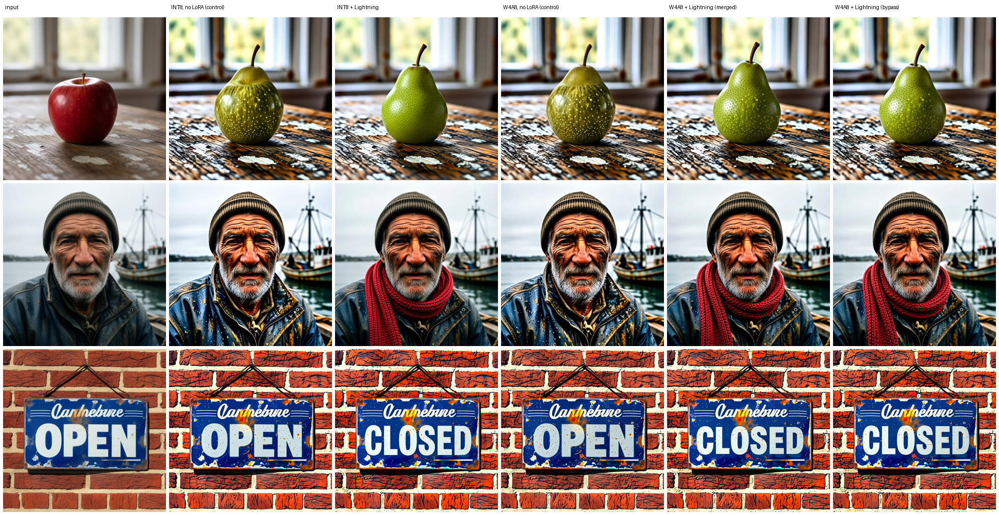

# Qwen-Image-Edit 2511 — 4-bit weights that work, and 4-bit activations that do not

One usable build, two measured failures, and the single axis that separates them.

**38.05 GiB → 10.79 GiB, 3.53x lighter**, and **1.77x smaller than the official INT8** while still
producing good images. The failures are published beside it because the axis they identify is worth
more than the file that works.

Method, tools and the full measurement log: **https://github.com/JoaoZaokk/comfy-quant-bench**

---

## The result, in one table

Every arm below is the same source, same converter, same calibration, same 12 renders (6 prompts ×
2 seeds, 20 steps, 1024 px, cfg 2.5, euler/simple) on one RTX 3090. Divergence is the mean relative
distance from the BF16 reference latent, paired run by run.

| build | weights | activations | GiB | divergence | s/step | picture |
|---|---|---|---|---|---|---|
| BF16 source | 16-bit | 16-bit | 38.05 | — | 5.693 | good |
| `int8_convrot` (Comfy-Org) | **8-bit** | 8-bit | 19.09 | **0.1942** | **1.410** | good |
| **`qwen_image_edit_2511_w4a8`** (this repo) | **4-bit** | 8-bit | **10.79** | 0.4997 | 1.575 | **good** |
| `qwen_image_edit_2511_w4a4` | 4-bit | **4-bit** | 9.60 | 1.7440 | 1.053 | **NOISE** |
| `qwen_image_edit_2511_mixed` | 4-bit | **4-bit on 607/840** | 9.88 | 1.8846 | 1.236 | **NOISE** |

**The weights are not the problem; the activations are.** W4A8 and W4A4 both carry 4-bit weights.
The only difference between the build that works and the build that renders static is whether the
activation path is 8-bit or 4-bit. And the mixed build settles it: with 233 of 840 layers already
promoted to 8-bit activations — an effective per-layer error of **0.0744**, *half* the error of a
Z-Image build that renders fine — it is still pure noise. **Leaving any layer on the 4-bit
activation path destroys this model.**

Against the official quantization the trade is explicit: **1.77x smaller, 1.12x slower per step,
2.57x further from the reference latent.** Comfy-Org ships full 8-bit weights
(`int8_tensorwise` + ConvRot rotation); this file ships 4-bit weights at the same activation
precision. If VRAM is the binding constraint, that is 8.3 GiB back. If latency is, theirs wins.

## The files

| file | bytes | GiB | layout |
|---|---|---|---|
| `qwen_image_edit_2511_w4a8.safetensors` | 11,581,151,872 | **10.79** | 840 × `asym_w4a8_int8`, `group_size` 16, `convrot_groupsize` 256 |

Source: `qwen_image_edit_2511_bf16.safetensors`, 40,861,031,560 B,
sha256 `0ae1768041ecad9c09ca8f989d2f9253148fe75baa3b923112181bc4949ef248`,
**20,430,401,088 parameters** summed from the Safetensors header across 1934 tensors — not
estimated from the file size. Every quantized layer resolves to `comfy_kitchen.backends.cuda`, on
all four ops the converter touches.

### What it looks like

| prompt | BF16 38.05 GiB | W4A8 10.79 GiB |
|---|---|---|
| six prompts × one seed |  | |

The failing builds are shown too, because "it renders static" is a claim that should be checkable:


## The edit path, which the table above does not measure

**Correction, 2026-09-13.** Everything above was measured with a text-to-image ladder: six
prompts, no input image, sampling from noise. **This is an image EDITOR, and that measurement
never edited anything.** An editor is judged by a third image the generator does not have — the
input — and specifically by what it *preserves*. The first version of this card shipped a verdict
about a path the model is not named after. This section is the repair.

12 real edits: 2 arms × 3 (image, instruction) pairs × 2 seeds, through the actual edit graph
(`TextEncodeQwenImageEditPlus` carrying the VAE and the image, `VAEEncode` feeding the sampler,
both conditionings through `FluxKontextMultiReferenceLatentMethod(index_timestep_zero)`,
`ModelSamplingAuraFlow` + `CFGNorm`), 1 megapixel, 30 steps, cfg 2.5, shift 3.0.

### What was asked, verbatim

The first version of this section said "apple→pear" and left the reader to guess the rest. The
owner's objection was fair: *"you say you asked it to edit — asked it to edit **what**?"* Every
instruction, the input it was given, and the check applied to the result:

| input image (1024×1024) | instruction, exactly as sent | counts as obeyed when |
|---|---|---|
| `edit_maca.png` — a red apple on a weathered wooden table, soft window light | `change the apple to a green pear, keep the table, the window light and the composition exactly the same` | a green pear where the apple was; table, light and framing unchanged |
| `edit_pescador.png` — close-up portrait of an elderly fisherman, weathered skin, grey stubble | `add a red knitted scarf around his neck, change nothing else` | a red knitted scarf; the face and everything else unchanged |
| `edit_placa.png` — a vintage enamel shop sign reading OPEN, chipped paint, red brick wall | `change the word on the sign to CLOSED, keep the same enamel sign, the same brick wall and the same lighting` | the sign legibly reads CLOSED; same sign, wall and light |

Negative prompt: a single space (the graph requires one; nothing was asked to be avoided). The
instructions were chosen so that success is **checkable by eye**, not a matter of taste.

**Where the inputs came from:** they are this model's own BF16 text-to-image renders from the
ladder above (prompts 0, 1 and 3, seed 1) — `qwen_image_edit_2511_bf16__p0_s1.png`, `__p1_s1.png`
and `__p3_s1.png`, copied unchanged into `ComfyUI/input/`. That is a deliberate choice with a
known cost: the inputs are in-distribution for the model, so a real photograph may behave
differently. It is also why the texture finding below is not about photographs.


Input, Comfy-Org's int8, ours. Seed 1.

| pair | seed | moved from input, int8 | moved from input, ours | arms diverge in the untouched region |
|---|---|---|---|---|
| apple→pear | 1 | 29.53 | 39.89 | 4.87 |
| apple→pear | 2 | 9.47 | 13.67 | 1.76 |
| +red scarf | 1 | 7.18 | 11.13 | 3.04 |
| +red scarf | 2 | 9.19 | 12.20 | 2.85 |
| OPEN→CLOSED | 1 | 42.32 | 41.02 | 6.95 |
| OPEN→CLOSED | 2 | 17.17 | 19.71 | 5.41 |

**All 12 obeyed the instruction.** Green pear, red scarf, legible CLOSED.

**Ours moves further from the input in 5 of 6 paired runs, median 1.34x — and that is a hint, not
a result.** The mean paired difference is +3.79 with a standard deviation of **3.78**: the effect
is the size of its own spread. The seed dominates everything else here — the *same* int8 arm
measures 29.53 and 9.47 on the two seeds of the same pair, a 3.1x swing, larger than any
difference between arms.

### The finding that is not about quantization

**Both arms destroy the wood grain and the brick, and both preserve a face.** Look at the first
and third rows: the table becomes a speckled mosaic and the wall becomes a saturated cartoon, in
Comfy-Org's build exactly as in ours. Only the middle row — the fisherman — comes through intact
in both.

This was nearly published here as a defect of *our* build, because it was first seen on ours. It
is not: the arm that exists to catch that caught it. **Fine high-frequency texture drifts; a face
does not**, and it is a property of the model or the regime, not of the format.

**Two explanations were proposed and both were tested and REFUTED.** Texture is measured as mean
absolute horizontal gradient over the table quadrant — higher means crunchier:

```
input photo                                   3.02
denoise 1.0   pear, table damaged             5.14
denoise 0.8   STILL AN APPLE, damaged         7.65   <- worst of all
denoise 0.6   STILL AN APPLE, damaged         6.17
denoise 0.4   STILL AN APPLE, damaged         5.05
VAE encode+decode only, no sampling           2.67   MAE 0.88 against the input
```

**Hypothesis 1, `denoise=1.0` regenerates everything: refuted.** Lowering denoise does not rescue
the texture — every level lands above the input, and 0.8 is the worst of the four. The refutation
condition was written before the run and fired exactly. It also exposed something the card would
otherwise have got wrong: **below 1.0 the edit stops working at all.** The apple stays an apple.
This model family carries the edit in the conditioning, so anchoring to the input latent just
re-asserts what was already there. `denoise=1.0` is *required*, and it is not the culprit.

**Hypothesis 2, the VAE round-trip: refuted.** Encoding and decoding the input with no sampling at
all costs **MAE 0.88** on the 0–255 scale and leaves the table slightly *smoother* (2.67), not
rougher. The VAE is nearly lossless here — and it is not quantized on this bench, by rule.

What the numbers point at instead: **the sampler adds high-frequency structure at every denoise
level tested**, while the VAE alone removes a little. The model is redrawing the wood grain in its
own hand, crunchier than the photograph. That is upstream of the format, which is why both
quantizations do it identically. Naming it precisely would need the BF16 arm, which this machine
cannot run in this graph.

### What this section does NOT cover

- **The reference is NOT the BF16 original.** It is Comfy-Org's int8, because the BF16 arm cannot
  be run in this graph on this machine — four distinct failures, recorded in
  `bench/qwen_edit_bf16_inalcancavel.md`. Every number above is distance to *that arm*, and both
  arms could be equally far from BF16 without it showing.
- **Damage both arms cause in the same place is invisible to the metric** — the "untouched region"
  is inferred from the arms themselves. The texture finding above came from looking, not from the
  number.
- Six paired observations, three images, one resolution, one step count, one cfg.

## Per-layer error, measured on real activations

840 Linear layers, **all 840 calibrated**. Each error is the relative error of that format against
a float32 reference, on the activation rows the model actually produced during sampling.

| format | median | p25 | p75 | max |
|---|---|---|---|---|
| `err_bf16` (the floor) | 0.0020 | 0.0019 | 0.0022 | 0.0028 |
| `err_w4a4` | 0.1080 | 0.0794 | 0.1571 | 0.2953 |
| `err_w4a8` | **0.0358** | 0.0269 | 0.0493 | 0.0804 |

**0.1080 is the lowest per-layer error that has ever produced garbage on this bench** — lower than
Krea 2 Turbo at 0.1199 and Z-Image v2 at 0.1254, both of which render fine in W4A4. The per-layer
criterion did rank the formats correctly here (W4A8 3.02x better) but it gave no warning that 4-bit
activations fall off a cliff on this model rather than degrading. Treat the criterion as a ranking,
never as a threshold.

### Which layers are expensive

60 transformer blocks × 14 Linear families = 840 layers. Median per family:

| family | shape | `err_w4a4` | `err_w4a8` | ratio |
|---|---|---|---|---|
| `attn.to_out.0` | [3072, 3072] | **0.2101** | 0.0589 | 3.57x |
| `txt_mlp.net.2` | [3072, 12288] | 0.1953 | 0.0583 | 3.35x |
| `attn.to_add_out` | [3072, 3072] | 0.1924 | 0.0486 | 3.96x |
| `img_mlp.net.2` | [3072, 12288] | 0.1689 | 0.0517 | 3.27x |
| `attn.to_v` | [3072, 3072] | 0.1506 | 0.0501 | 3.01x |
| `attn.add_v_proj` | [3072, 3072] | 0.1346 | 0.0454 | 2.96x |
| `attn.add_q_proj` | [3072, 3072] | 0.1118 | 0.0379 | 2.95x |
| `img_mlp.net.0.proj` | [12288, 3072] | 0.1078 | 0.0367 | 2.94x |
| `attn.to_q` | [3072, 3072] | 0.0961 | 0.0326 | 2.95x |
| `attn.to_k` | [3072, 3072] | 0.0926 | 0.0315 | 2.94x |
| `txt_mlp.net.0.proj` | [12288, 3072] | 0.0918 | 0.0310 | 2.96x |
| `attn.add_k_proj` | [3072, 3072] | 0.0841 | 0.0285 | 2.96x |
| `img_mod.1` | [18432, 3072] | 0.0281 | 0.0068 | 4.11x |
| `txt_mod.1` | [18432, 3072] | **0.0248** | 0.0060 | 4.14x |

**The modulation layers are the cheapest in the whole block** — `txt_mod.1` at 0.0248 against
`attn.to_out.0` at 0.2101, a factor of **8.5**. Fourth architecture on this bench where modulation
is the *safest* place to spend 4 bits, against a widely repeated instinct that it is too sensitive
to quantize. The instinct has never arrived here with a measurement attached.

**Output projections expensive, input projections cheap, and the ordering transfers**: Krea 2 Turbo
measured `attn.wo` worst (0.2181) and `attn.wk` cheapest (0.0749) — different architecture,
different parameter count, same shape of answer. Worth naming because two other transfer hypotheses
died on this bench (size-monotonicity, and the groupsize ratio), so one that carries is the
exception.

## Things that were ruled out before blaming the model

The W4A4 failure looked like a broken file, and it is not:

- **Dispatch, counted on a real forward after load:** 840 modules with `quant_format
  convrot_w4a4` and `TensorCoreConvRotW4A4Layout`, **8/8 quantized forwards, 0 dequantize**,
  `convrot_linear_dtype=int4`, `impl=comfy_kitchen.backends.cuda`, 840 quantized weights on
  `cuda:0`. The 4-bit kernel really runs.
- **Structural verification:** PASS. **Byte-identical comparison of every preserved tensor against
  the source:** PASS. **Real-kernel smoke against `F.linear` on the BF16 source:** `relative_rmse`
  0.2265, an ordinary value.
- **Metadata keys:** all 840 have a matching `.weight` in the file, in the same names the working
  Comfy-Org build uses.

Two hypotheses were tested here and **refuted**, and both are recorded because a refuted hypothesis
is cheaper to inherit than to rediscover. First, that our file's metadata dialect stops matching
after ComfyUI renames modules at load — the dispatch count says the config reaches every module.
Second, that median per-layer error × layer count predicts the break: it separates nine builds
perfectly, and then dies on a tenth that was already on disk — `hunyuan15-misto-t025` scores 79.0
and renders correctly while a Z-Image build scores 31.4 and renders garbage.

## Does a LoRA work on this file? The Lightning 4-step LoRA, with the control that has to fail

A LoRA loaded the normal way (`LoraLoaderModelOnly`) onto a quantized weight is not kept as a
separate branch: ComfyUI dequantizes the weight, adds the delta, and **requantizes it back to
4 bits** (`comfy/ops.py:1449-1457`). So the question "does the LoRA arrive?" has two layers, and
they disagree here — which is the finding.

**At the weight** (`tools/probe_lora_requant.py`, 24 sampled layers, the real
`patch_weight_to_device` path): `Qwen-Image-Edit-2511-Lightning-4steps-V1.0` matches all 720
target weights (0 unmapped keys); its delta is tiny (|δ|/|W| median 0.0005); after requantization
**86 % of the delta survives** (71–91 % per layer), the cosine between what the LoRA asked and what
landed is 0.01, and the noise the requantization adds is **103x the LoRA itself**. Per-layer weight
error against the BF16 source goes 0.0731 → 0.0835 — indistinguishable from requantizing with no
LoRA at all (0.0836). By this layer the LoRA looks buried.

**At the output**, on the three edits above, 4 steps, cfg 1.0, seed 1:



Columns: input · INT8 without the LoRA · INT8 + Lightning · **this file** without the LoRA ·
**this file** + Lightning merged (the normal loader) · **this file** + Lightning in bypass
(`LoraLoaderBypassModelOnly`, which keeps the delta as a BF16 branch and never touches the weight).

The Lightning LoRA is what makes 4 steps possible, so it carries its own control: **without it,
4 steps must fail — and they do, identically in INT8 and in this file**: no scarf, the sign still
says OPEN, the apple becomes a speckled hybrid, every texture oversharpened. **With it, all three
LoRA arms obey all three instructions** — smooth green pear, red knitted scarf, legible CLOSED.
Merged and bypass on this file differ by 1.26 in the region both left alone
(`tools/analisa_edicao.py`), against 3.5–3.9 between either of them and INT8 + Lightning: the
difference between the two LoRA paths is smaller than the difference between formats, and inside
trajectory noise.

**So the weight-level numbers overstate the damage, in the same way per-layer error does for
formats on this bench: they rank and they alarm, they do not decide.** Seven hundred layers of
unbiased noise cancel in the forward pass, and losing 14 % of a rank-64 delta at strength 1.0 does
not change the regime it installs. The output, with the control that has to fail beside it, is the
judge. One caveat travels with this: the 4-step LoRA is the most robust kind by construction — it
changes the whole sampling regime. A subtle style LoRA could be lost where this one was not, and
that was not measured here.

## What is NOT covered

- **The W4A4 and mixed builds are not published as usable models.** They are a measured negative.
- **One card (RTX 3090, sm86), one sampler, one scheduler, one resolution, 12 renders per arm.**
- `convrot_groupsize` **256 only**. W4A4 also accepts 16 / 64 / 1024 and none was tried on this
  model; W4A8 accepts only 256, so that axis cannot move for the build that works.
- **No perceptual metric.** Latent divergence measures where the sampler went, not whether a human
  prefers the picture. For calibration: a Z-Image W4A4 build that renders fine sits at 0.7854, so
  this file's 0.4997 is inside the band that has always worked here, and 1.74 is outside anything
  this bench has ever called usable.
- **The text encoder is not in this repo** and the **VAE is not quantized and will not be** — 254
  MiB against a 38 GiB transformer is noise for the risk.
- **Three other builds of this same model sit on the same disk and are not compared**: Nunchaku
  SVDQuant INT4 (13.19 GiB), a GGUF `Q4_K_M` (12.33 GiB), and the BF16 itself. Both loaders are
  installed, so this is a **choice, not a limitation** — neither goes through
  `comfy.sd.load_diffusion_model`, so they need matched separate runs compared through the saved
  latents.

## Credits

- **[Qwen](https://huggingface.co/Qwen) (Alibaba)** — the Qwen-Image-Edit-2511 model. Everything
  here is a re-encoding of their weights.
- **[Comfy-Org](https://huggingface.co/Comfy-Org/Qwen-Image-Edit_ComfyUI)** — the repackaged BF16
  single-file weights these builds were converted from, and the `int8_convrot` build used as the
  comparison arm. It is the most faithful arm measured here and it is theirs.
- **ComfyUI / comfy-kitchen** — the `convrot_w4a4` and `asym_w4a8_int8` formats, the
  `MixedPrecisionOps` dispatch, and the CUDA kernels that execute them.

## Reproducing

```bash
python tools/quant_mixed.py --input qwen_image_edit_2511_bf16.safetensors \
  --analysis calib/qwen_image_edit_2511.analysis.json \
  --promote-error 0.0 --budget 1.0 --uncalibrated fail \
  --output qwen_image_edit_2511_w4a8.safetensors
python tools/quality_ladder.py --reference <bf16> --models <w4a8> <w4a4> <int8_convrot> \
  --clip qwen_2.5_vl_7b.safetensors --clip-type qwen_image --vae qwen_image_vae.safetensors \
  --seeds 1 2 --steps 20 --size 1024 --cfg 2.5
python tools/probe_quant_dispatch.py qwen_image_edit_2511_w4a8.safetensors --mode diffusion --forward-only
```
